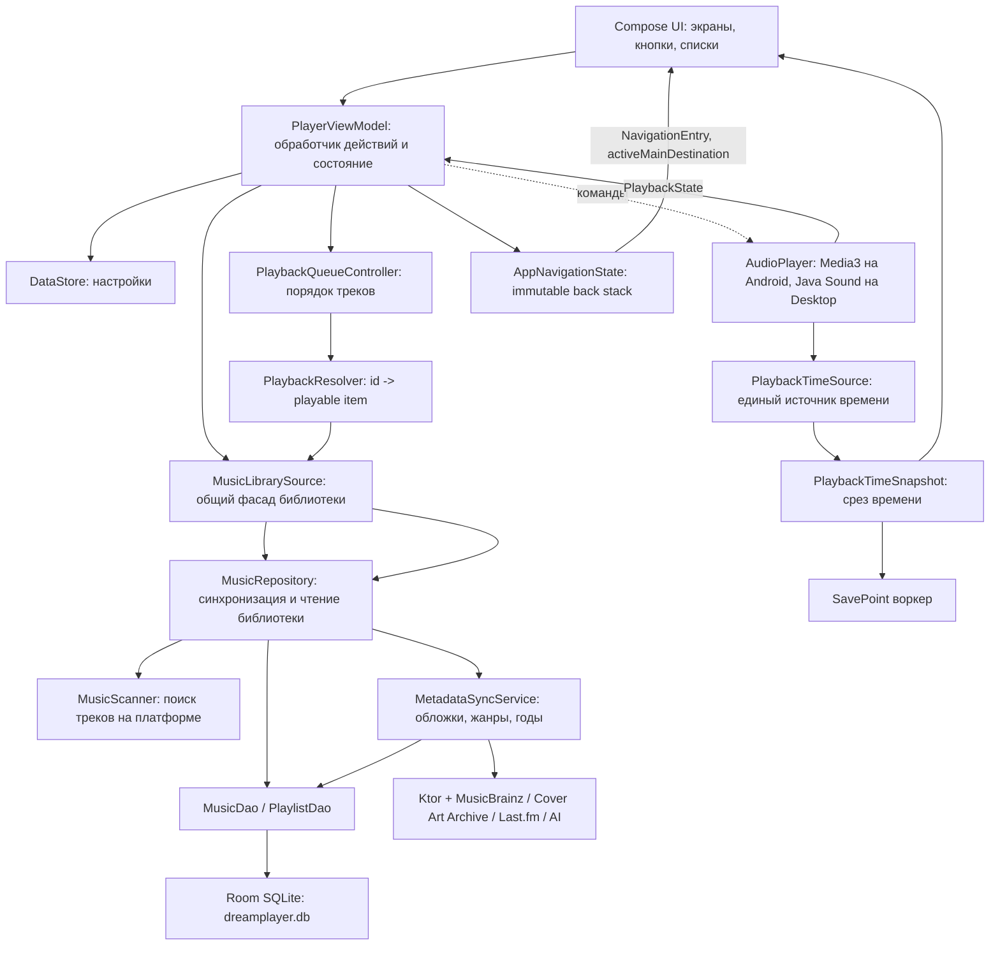
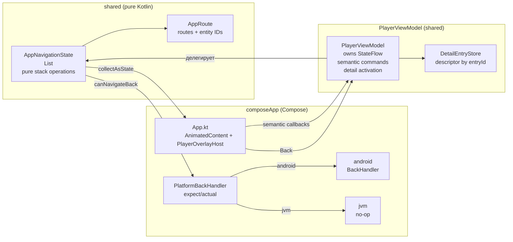

# Слепок архитектуры DreamPlayer

Этот документ описывает, как в проекте связаны база данных, сканеры музыки, источники данных, обработчики пользовательских действий, обогащение метаданными и воспроизведение. Формулировки намеренно простые: представь приложение как музыкальную библиотеку с кладовщиком, каталогом, кассиром на выдаче и проигрывателем.
This document describes architectural contracts rather than implementation details. If the implementation changes while preserving the contract, the document does not necessarily need to change. If an architectural contract changes, this document must be updated.

## Related documents

- Playback Time Architecture

## Главная идея

В приложении есть несколько слоев:

- UI показывает экраны и принимает клики пользователя.
- `PlayerViewModel` превращает клики в действия: загрузить библиотеку, открыть альбом, включить трек, перемешать очередь.
- `MusicLibrarySource` скрывает различия платформ: Android и Desktop вызывают один общий интерфейс, но внутри используют разные сканеры.
- `MusicRepository` синхронизирует музыку с базой: берет сырые треки от сканера, создает артистов/альбомы/треки, помечает пропавшие файлы, запускает дозагрузку метаданных.
- Room/SQLite хранит основную музыкальную библиотеку, плейлисты и состояние синхронизации.
- DataStore хранит пользовательские настройки.
- `PlaybackTimeSource` предоставляет актуальное время воспроизведения напрямую UI и SavePoint-воркеру, минуя ViewModel.
- Playback-слой берет id треков из базы, превращает их в воспроизводимые URI и отдает платформенному плееру.
- `AppNavigationState` — платформенно-независимая навигация: immutable back stack из уникальных `NavigationEntry` и чистые операции переходов.

Воспроизведение разделено на два независимых потока: **состояние** (очередь, repeat, shuffle — через ViewModel) и **время** (позиция, длительность — через PlaybackTimeSource напрямую потребителям).



## Architectural Invariants

The following rules are considered architectural contracts. Changing any of them requires an explicit architectural decision.

- **PlayerViewModel is the single application orchestrator.**
- **PlaybackTimeSource is the only source of playback timing.**
- **AppNavigationState is the only source of navigation state.**
- Navigation remains platform-independent.
- Navigation state is immutable.
- Navigation transitions remain pure and return a new state.
- Navigation never owns screen data.
- UI decides how destinations are rendered.
- Playback pipeline never depends on Compose.
- Repository layer never depends on UI.
- Platform-specific code never leaks into shared business logic.

## Навигация

Навигация построена на платформенно-независимой immutable-модели в `shared`. Она не зависит от Compose, Android или Desktop. Compose напрямую собирает её `StateFlow` и сам решает, что рисовать как content, dock destination или overlay.

### Navigation Principles

1. **Platform-independent** — core написан на чистом Kotlin без UI/platform imports.
2. **Immutable state** — операции возвращают новый `AppNavigationState`, исходный объект не изменяется.
3. **Single live owner** — `PlayerViewModel` владеет единственным `StateFlow<AppNavigationState>`.
4. **Entry identity** — каждый динамический вход имеет уникальный `entryId`; одинаковый route может честно встречаться в истории несколько раз.
5. **Structural rules only** — core проверяет форму стека, а доступность контекстных ссылок задаётся semantic callbacks экранов.
6. **External rendering** — Compose владеет анимациями, saveable state, системным Back и будущей Predictive Back-интеграцией.
7. **No screen data in routes** — route хранит только тип назначения и идентификаторы сущностей.

### Ключевые компоненты

- `AppRoute` — sealed route model: `Home`, `Library`, `Search`, `Playlist(id)`, `LibraryCollection(type, id)`, `Settings`, `AiDebugSettings`, `Player`, `Queue`.
- `NavigationEntry(entryId, route)` — элемент истории со стабильной identity.
- `AppNavigationState` — immutable stack и pure operations: `selectMainPage`, `openSearch`, `closeSearch`, `push`, `pop`, `previewBack`, `removePlaybackOverlays`.
- `MainDestination` — вычисляемое активное назначение dock: Home, Library или Search.
- `DetailEntryStore` — принадлежащий ViewModel store лёгких header descriptors по `entryId`; tracks/albums в нём не хранятся.

### Как устроен back stack

Home всегда является первым entry. Library — вторая основная страница, поэтому Back из Library возвращает Home. Повторный выбор Home/Library сбрасывает соответствующий detail suffix.

```text
[Home]
  -> selectMainPage(Library) -> [Home, Library]
  -> push(Genre(5))          -> [Home, Library, Genre(5)]
  -> push(Album(42))         -> [Home, Library, Genre(5), Album(42)]
  -> push(Player)            -> [Home, Library, Genre(5), Album(42), Player]
  -> push(Queue)             -> [Home, Library, Genre(5), Album(42), Player, Queue]
```

Последовательный exact duplicate верхнего route игнорируется. Тот же route после другого entry получает новый ID. `pop()` на Home возвращает `null`; UI интерпретирует это как отсутствие внутреннего Back.

Search является отдельным main destination, но визуально рендерит библиотечный поиск:

```text
Home -> Search       = [Home, Search]
Library -> Search    = [Home, Library, Search]
Search -> detail     = Search остаётся active main
closeSearch()        = удалить Search и весь suffix, сохранить Home/Library anchor
```

Query и результаты живут, пока Search entry остаётся в стеке. После committed удаления Search они очищаются.

### Overlay Principle

`Player` и `Queue` образуют только suffix `Player` либо `Player -> Queue`. `currentDestination` может быть overlay, а `currentContentEntry` всегда указывает на контент под ним. Queue допускается только сразу после Player. Back закрывает Queue, затем Player, затем content history. Наличие текущего трека проверяет ViewModel, а не navigation core.

### Владение навигацией

`PlayerViewModel` — единственный владелец живого `AppNavigationState`. Он отвечает за:

- semantic commands (`selectMainPage`, `openSettings`, `openPlaylist`, `openAlbumDetails`, `openPlayer`, `openQueueSheet` и т.д.);
- единую публикацию committed navigation state;
- регистрацию detail descriptor до публикации route;
- запуск и отмену reactive detail subscription при смене `currentContentEntry`;
- защиту async updates по active `entryId`;
- cleanup descriptors и Search state после commit.

### Как UI узнаёт о навигации

Compose собирает `StateFlow<AppNavigationState>` напрямую:

- `currentContentEntry` — target для `AnimatedContent`;
- `NavigationEntry.entryId` — dynamic saveable key;
- Home/Library используют стабильные presentation IDs;
- `activeMainDestination` управляет dock;
- наличие `Player`/`Queue` routes управляет overlays;
- `canNavigateBack` управляет `PlatformBackHandler`.

`Screen`, `AppDestination` и navigation-поля в `PlaybackUiState` удалены: параллельной проекции больше нет.

### Обработка системной кнопки "Назад"

`PlatformBackHandler` — Compose `expect`/`actual`:
- Android: использует `BackHandler` из `androidx.activity.compose`.
- Desktop: no-op.

Core уже предоставляет side-effect-free `previewBack()`. Визуальная Android Predictive Back-интеграция остаётся отдельным поздним этапом и не требует переписывать stack model.

### Что навигация НЕ делает

Navigation does not:

- загружать данные экрана
- знать о Compose, Android или SwiftUI
- управлять воспроизведением
- владеть моделями данных экранов (selectedPlaylist, selectedLibraryCollection и т.д.)
- запускать корутины
- выполнять побочные эффекты
- знать о lifecycle приложения
- управлять анимациями переходов

### Схема навигации



## Где что лежит

Проект разделён на два основных модуля — `shared` (бизнес-логика) и `composeApp` (UI):

**Модуль `shared/`** — бизнес-логика, база данных, сетевое взаимодействие, воспроизведение:
- `shared/src/commonMain/kotlin/.../database/` — Room: `AppDatabase.kt`, `dao/*`, `entities/*`.
- `shared/src/commonMain/kotlin/.../library/` — `MusicScanner.kt`, `MusicRepository.kt`, `MusicLibrarySource.kt`.
- `shared/src/commonMain/kotlin/.../library/metadata/` — `MetadataSyncService`, `EmbeddedMetadataReader`.
- `shared/src/commonMain/kotlin/.../playback/` — `AudioPlayer` expect/actual, `PlaybackQueueController`, `PlaybackResolver`.
- `shared/src/commonMain/kotlin/.../model/` — `PlayerViewModel.kt`.
- `shared/src/commonMain/kotlin/.../navigation/` — `AppRoute.kt`, `NavigationEntry.kt`, `AppNavigationState.kt`: платформенно-независимые routes, entry identity и pure stack operations.
- `shared/src/commonMain/kotlin/.../extensions/` — AI, network, secrets, data.
- `shared/src/commonMain/kotlin/.../features/` — фичи (ежедневный плейлист и т.д.).
- `shared/src/androidMain/` / `jvmMain/` / `appleMain/` — platform `actual`-реализации (14 expect-деклараций).

**Модуль `composeApp/`** — UI на Compose Multiplatform:
- `composeApp/src/commonMain/kotlin/.../app/` — `App.kt`, `Color.kt`, `Theme.kt`.
- `composeApp/src/commonMain/kotlin/.../ui/` — все экраны и компоненты.
- `composeApp/src/androidMain/` / `jvmMain/` — platform `actual`-реализации для UI.

Compose используется **только** в модуле `composeApp`. В модуль `shared` Compose не попадает — UI и логика строго разделены.

## Dependency Rules

### Allowed dependencies

```
UI
    ↓
PlayerViewModel
    ↓
Repositories
    ↓
Database / Network
```

```
UI
    ↓
PlaybackTimeSource
```

```
UI
    ↓
AppNavigationState
```

### Forbidden dependencies

- Repositories → UI
- Playback → Compose
- Navigation → Compose
- Navigation → Android
- Navigation → Desktop
- Navigation → SwiftUI
- Database → UI
- Shared → composeApp

## Ownership

- **PlayerViewModel** owns: application orchestration, library loading, playback commands, navigation state, user actions
- **AppNavigationState** owns: back stack, current destination, stateless transitions
- **PlaybackTimeSource** owns: playback timing (position, duration, speed)
- **MusicRepository** owns: synchronization with database, persistence
- **AudioPlayer** owns: platform-specific playback
- **UI** owns: rendering, animations, overlays, back gestures, Predictive Back

## Non-goals

This architecture intentionally does NOT provide:

- dependency injection framework
- navigation framework
- event bus
- MVI / Redux / unidirectional data flow
- Android ViewModel
- Jetpack Lifecycle in shared code
- Jetpack Navigation / Compose Navigation
- routing library
- service locator
- global event bus

## Extension Rules

### When adding a new feature

**Prefer:**
- new repository
- new use-case (method on PlayerViewModel)
- new UI state field
- new navigation destination

**Avoid:**
- adding responsibilities to existing classes
- cross-module dependencies
- platform checks in shared code
- global mutable state
- adding Compose dependencies to shared

## Refactoring Rules

**Refactoring should:**
- preserve behavior
- preserve public architecture
- avoid introducing abstractions without need
- prefer extraction over rewriting
- prefer composition over inheritance
- avoid speculative generalization

## Performance Principles

- UI must never block.
- Database work must never execute on UI thread.
- Playback timing must not be interpolated inside ViewModel.
- Large libraries (50k+ tracks) are a primary target.
- Avoid unnecessary allocations in hot paths.
- Prefer immutable snapshots.
- Prefer incremental updates over full reloads.

## Cross-platform Principles

- Business logic belongs to shared.
- Platform APIs stay inside `actual` implementations.
- Shared code must not depend on Android APIs.
- Shared code must not depend on Desktop APIs.
- Shared code must remain usable by Desktop and future Apple targets.
- `expect`/`actual` is the only platform abstraction mechanism.
- Avoid platform checks (`when (platform)`) in shared code — prefer `expect`/`actual` instead.

## База данных

Основная база - Room поверх SQLite. На обеих платформах файл называется `dreamplayer.db`, но лежит в разных местах:

- Android: `applicationContext.getDatabasePath("dreamplayer.db")`.
- Desktop: папка приложения `DreamPlayer` внутри `%APPDATA%`, `~/Library/Application Support` или `~/.config`.

Создание базы:

```kotlin
Room.databaseBuilder<AppDatabase>(
    context = applicationContext,
    name = dbFile.absolutePath,
    factory = AppDatabaseConstructor::initialize
)
    .setDriver(BundledSQLiteDriver())
    .addMigrations(Migration1To2, Migration2To3, ...)
    .setJournalMode(RoomDatabase.JournalMode.WRITE_AHEAD_LOGGING)
    .build()
```

Простыми словами: Room дает типобезопасный Kotlin-доступ к SQLite, а WAL-режим помогает читать и писать базу без лишних тормозов UI.

### Основные таблицы

- `artists` - артисты. Уникальны по имени.
- `albums` - альбомы. Привязаны к артисту через `artistId`.
- `library_tracks` - треки. У каждого трека есть путь/URI, название, артист, альбом, длительность, размер файла, признак наличия.
- `playlists` - пользовательские и системные плейлисты.
- `playlist_track_cross_ref` - связь “плейлист содержит трек” плюс позиция в плейлисте.
- `genres` - жанры.
- `album_genre_cross_ref`, `track_genre_cross_ref` - связи альбомов/треков с жанрами.
- `sync_audit` - журнал синхронизаций: когда сканировали, сколько нашли, успешно или с ошибкой.
- `album_metadata_state`, `track_metadata_state`, `metadata_resolution` - служебные таблицы для понимания, откуда взяты метаданные и насколько им можно доверять.

Связь можно читать так:

```text
Artist 1 -> много Albums
Album 1 -> много Tracks
Playlist много -> много Tracks через playlist_track_cross_ref
Genre много -> много Albums/Tracks через cross_ref таблицы
```

Пример сущности трека:

```kotlin
@Entity(tableName = "library_tracks")
data class TrackEntity(
    @PrimaryKey(autoGenerate = true) val id: Long = 0,
    val filePath: String,
    val title: String,
    val artistName: String,
    val albumName: String,
    val artistId: Long,
    val albumId: Long,
    val durationMs: Long,
    val fileSize: Long,
    val lastModified: Long,
    val mediaStoreId: Long? = null,
    val contentFingerprint: String = "",
    val fileHash: String? = null,
    val availability: String = "AVAILABLE",
    val albumArtUri: String? = null,
    val isPresent: Boolean = true,
    val lastSeenTimestamp: Long,
    val musicBrainzRecordingMbid: String? = null,
    val identitySourceTrust: Int = 0,
    val titleSortKey: String = "",
    val artistSortKey: String = "",
    val deletedAt: Long? = null,
)
```

Для не-разработчика: это карточка песни в каталоге. В ней есть “где лежит файл”, “как называется”, “кто исполнитель”, “к какому альбому относится”, “можно ли сейчас включить”.

## DAO: кто читает и пишет базу

`MusicDao` работает с музыкальной библиотекой:

- вставляет артистов, альбомы, жанры;
- обновляет треки;
- отдает страницы треков/альбомов/артистов/жанров для UI;
- выбирает альбомы, которым нужны обложки или метаданные;
- помечает пропавшие треки;
- хранит audit синхронизации.

Пример: UI просит страницу треков, а DAO отдает уже готовые карточки для списка:

```kotlin
@Query("""
    SELECT t.id, t.title, t.artistName, t.albumName AS albumTitle, t.durationMs,
        a.year, a.genre,
        COALESCE(NULLIF(t.albumArtUri, ''), NULLIF(a.albumArtUri, ''), NULLIF(a.coverUri, '')) AS artworkUri
    FROM library_tracks t
    LEFT JOIN albums a ON t.albumId = a.id
    WHERE t.isPresent = 1
    ORDER BY t.titleSortKey ASC, t.id ASC
    LIMIT :limit
""")
suspend fun getTrackListItemsByTitle(...): List<TrackListItem>
```

`PlaylistDao` работает с плейлистами:

- создает плейлист;
- читает пользовательские плейлисты;
- читает треки конкретного плейлиста;
- заменяет состав плейлиста одной транзакцией.

## DataStore: настройки, не музыка

`DataStore` хранит настройки:

- включен ли blur;
- принудительная темная тема;
- режим генерации плейлиста дня;
- выбранный AI-провайдер, модель и промпт.

Это не основная база библиотеки. Если Room - большой каталог музыки, то DataStore - маленький блокнот с настройками пользователя.

## Сканеры

Общий контракт:

```kotlin
interface MusicScanner {
    fun scan(): Flow<RawTrackData>
    fun observeChanges(): Flow<Unit>
}
```

`scan()` находит треки и отдает поток `RawTrackData`. Это еще не запись базы, а “сырой результат сканирования”.

```kotlin
data class RawTrackData(
    val path: String,
    val mediaStoreId: Long? = null,
    val title: String?,
    val artist: String?,
    val album: String?,
    val durationMs: Long,
    val fileSize: Long,
    val lastModified: Long,
    val albumArtUri: String? = null,
    val albumArtSource: CoverSource = CoverSource.NONE,
)
```

### Android: MediaStoreScanner

Android не ходит по файловой системе напрямую. Он спрашивает системный каталог медиафайлов `MediaStore`.

Что делает:

- выбирает только музыкальные записи `IS_MUSIC != 0`;
- читает id, title, artist, album, duration, size, date_modified, album_id;
- строит `content://...` URI трека;
- строит URI локальной обложки альбома;
- подписывается на изменения `MediaStore` через `ContentObserver`.

Для не-разработчика: Android уже ведет свой список музыки на устройстве, приложение спрашивает этот список у системы.

### Desktop/JVM: JvmMusicScanner

Desktop-версия смотрит папку `~/Music`.

Что делает:

- берет файлы с расширениями `flac`, `mp3`, `wav`;
- через Java Sound и дополнительные декодеры читает формат;
- для MP3/FLAC пытается достать встроенную обложку;
- если встроенной обложки нет, ищет рядом `cover.jpg`, `folder.png`, `front.webp` и похожие файлы;
- возвращает `RawTrackData`.

Для не-разработчика: Desktop сам открывает папку с музыкой и читает бирки внутри файлов.

## Синхронизация библиотеки

Сердце процесса - `MusicRepository.sync()`.

Упрощенный сценарий:

1. Сканер находит сырые треки.
2. Репозиторий создает недостающих артистов.
3. Репозиторий создает недостающие альбомы.
4. Репозиторий обновляет или вставляет треки.
5. Старые треки, которых больше не нашли, помечаются как missing.
6. Очень старые удаленные записи чистятся.
7. Пишется `sync_audit`.
8. Очищается кеш playback-элементов.
9. Запускается фоновая дозагрузка обложек/метаданных.

Фрагмент:

```kotlin
val rawTracks = scanner.scan().toList()
val artistMap = syncArtists(rawTracks)
val albumMap = syncAlbums(rawTracks, artistMap, currentSyncTimestamp)

rawTracks.chunked(BatchSize).forEach { batch ->
    processBatch(batch, currentSyncTimestamp, artistMap, albumMap, movedTrackQueues)
}

markMissingTracks(rawTracks, currentSyncTimestamp)
musicDao.insertAudit(SyncAuditEntity(...))
metadataSyncService.startAutoBatch()
```

Важная деталь: трек сопоставляется не только по пути. Если файл переехал, код пытается узнать его по “подписи”: название + артист + длительность + размер. Это снижает шанс потерять историю трека при переносе файла.

## Метаданные и обложки

Есть два вида обогащения:

### Локальные embedded-метаданные

После обновления треков `MusicRepository` запускает чтение встроенных тегов:

- MusicBrainz recording MBID;
- жанры;
- год;
- fingerprint тегов.

Если найден `recordingMbid`, он записывается в `library_tracks.musicBrainzRecordingMbid`. Если найдены жанры, они пишутся в `genres` и `track_genre_cross_ref`.

### Сетевые метаданные

`MetadataSyncService` работает с альбомами:

- сначала ищет обложки через MusicBrainz/Cover Art Archive;
- затем, при ручной синхронизации, добирает год/жанры/обложки через MusicBrainz и Last.fm;
- учитывает rate limit;
- хранит состояние `NOT_SYNCED`, `PENDING`, `DONE`, `FAILED`, `NO_MATCH`;
- использует “trust” числа, чтобы более надежный источник не перезаписывался менее надежным.

Пример логики доверия:

```kotlin
val yearChoice = chooseTrustedValue(
    current = album.year,
    currentTrust = album.yearSourceTrust,
    candidates = listOf(
        TrustedValue(musicBrainz?.year, TRUST_MUSICBRAINZ_YEAR),
        TrustedValue(lastFmMetadata?.year, TRUST_LASTFM_YEAR),
    ),
)
```

Для не-разработчика: если год уже был найден из более надежного места, приложение не заменяет его чем-то сомнительным.

## Источники данных

- Android MediaStore - локальная медиатека устройства.
- Desktop `~/Music` - локальные аудиофайлы.
- Embedded tags - данные внутри MP3/FLAC.
- Sidecar images - картинки рядом с аудиофайлом: `cover`, `folder`, `front`.
- MusicBrainz - идентификация альбомов, годы, жанры, release group MBID.
- Cover Art Archive - обложки по MusicBrainz release group.
- Last.fm - жанры, даты, обложки, если задан API-ключ.
- AI-провайдеры - только для плейлиста дня: OpenAI, Gemini, DeepSeek.

Сетевые запросы идут через Ktor и проверяются `SecureNetworkPolicy`: только HTTPS и только разрешенные host.

```kotlin
object NetworkHosts {
    const val OPEN_AI = "api.openai.com"
    const val GEMINI = "generativelanguage.googleapis.com"
    const val DEEP_SEEK = "api.deepseek.com"
    const val LAST_FM = "ws.audioscrobbler.com"
    const val MUSIC_BRAINZ = "musicbrainz.org"
    const val COVER_ART_ARCHIVE = "coverartarchive.org"
    const val INTERNET_ARCHIVE = "archive.org"
}
```

## Плейлисты

Плейлист - это не копия треков, а список ссылок на треки.

```kotlin
data class PlaylistTrackCrossRef(
    val playlistId: Long,
    val trackId: Long,
    val position: Int
)
```

`PlaylistRepository` дает простые операции:

- создать пользовательский плейлист;
- получить треки плейлиста;
- заменить треки плейлиста;
- подготовить перемешанную очередь.

Есть два системных плейлиста:

```kotlin
object SystemPlaylists {
    const val DAILY_PLAYLIST_ID = -1L
    const val DAILY_PLAYLIST_NAME = "Плейлист дня"
    const val FAVORITES_PLAYLIST_ID = -2L
    const val FAVORITES_PLAYLIST_NAME = "Избранное"
}
```

`DailyPlaylist` (-1) скрыт из списка плейлистов (виден только на главном экране), `Favorites` (-2) — обычный избранный плейлист, пользователь может добавлять и удалять треки.

## Плейлист дня и AI

`DailyPlaylistRepository` каждый день проверяет, нужно ли пересобрать системный плейлист.

Варианты:

- `LOCAL_DAILY` - взять случайные доступные треки из базы.
- `AI_API` - взять до 200 случайных кандидатов, отправить их AI-провайдеру, получить список id, отфильтровать и сохранить.

Если AI не сработал, приложение падает обратно на локальный вариант, а в debug-info сохраняет причину.

Для не-разработчика: AI не получает файлы музыки, он получает таблицу кандидатов вида “id, артист, трек, альбом” и возвращает id подходящих треков.

## Воспроизведение

Воспроизведение специально отделено от базы. Плеер не должен сам ходить в SQL. Он получает готовый `PlaybackSnapshot`.

Время воспроизведения отделено от состояния приложения и обрабатывается через отдельный канал.

### Основные участники

- `PlaybackQueueController` хранит порядок id треков, текущий индекс, shuffle и версию очереди.
- `PlaybackResolver` превращает id треков в `ResolvedPlaybackItem`.
- `MusicLibrarySource.resolvePlayableItems()` читает треки из базы через `MusicRepository`.
- `AudioPlayer` играет уже resolved-элементы.
- `PlaybackTimeSource` — абстракция над временем воспроизведения. Единственный источник playback-тайминга. Не содержит бизнес-логики, не занимается отрисовкой, не интерполирует и не экстраполирует время.
- `PlaybackTimeSnapshot` — атомарный срез времени: позиция, длительность, скорость, состояние игра/пауза. Потребители получают время только через этот снапшот, никогда не восстанавливают его из нескольких независимых геттеров.

Модель воспроизведения:

```kotlin
data class PlaybackItemRef(
    val trackId: Long,
    val uri: String,
    val availability: TrackAvailability,
    val contentVersion: Long,
)

data class ResolvedPlaybackItem(
    val ref: PlaybackItemRef,
    val metadata: TrackPlaybackMetadata,
)
```

`trackId` - номер карточки в каталоге. `uri` - где реально лежит аудио. `availability` - можно ли его сейчас включить. `contentVersion` - версия содержимого, чтобы кеш MediaItem не устаревал.

### Что происходит, когда пользователь нажимает на трек

1. UI вызывает `playerViewModel.playFromVisibleTracks(...)`.
2. `PlayerViewModel` кладет id треков в `PlaybackQueueController`.
3. `PlaybackResolver` просит библиотеку разрешить id в playable items.
4. `PlayerViewModel` обновляет UI-состояние.
5. `AudioPlayer.play(snapshot)` отправляет очередь платформенному плееру.

Ключевой фрагмент:

```kotlin
private fun playPreparedQueue(tracks: List<LibraryTrack>, startIndex: Int) {
    val snapshot = playbackQueueController.setQueue(
        trackIds = tracks.map { it.id }.toLongArray(),
        startIndex = startIndex,
    )
    applyQueueSnapshot(snapshot, PlaybackSnapshotApplyMode.Play)
}
```

А затем:

```kotlin
private fun applyQueueSnapshot(queueSnapshot: PlaybackQueueSnapshot, mode: PlaybackSnapshotApplyMode) {
    storeScope.launch {
        val playbackSnapshot = PlaybackResolver.resolve(queueSnapshot)
        ...
        when (mode) {
            PlaybackSnapshotApplyMode.Play -> AudioPlayer.play(playbackSnapshot)
            PlaybackSnapshotApplyMode.Update -> AudioPlayer.updateQueue(playbackSnapshot)
            PlaybackSnapshotApplyMode.Move -> AudioPlayer.moveQueueItem(...)
        }
    }
}
```

### Android AudioPlayer

Android использует Media3:

- `PlaybackService` создает `ExoPlayer` и `MediaSession`;
- `AudioPlayer.android.kt` подключается к сервису через `MediaController`;
- треки превращаются в `MediaItem`;
- системная media session позволяет нормальную интеграцию с Android.

Пример превращения трека в Media3 item:

```kotlin
MediaItem.Builder()
    .setMediaId(trackId.toString())
    .setUri(ref.uri.toUri())
    .setMediaMetadata(
        MediaMetadata.Builder()
            .setTitle(metadata.title)
            .setArtist(metadata.artistName)
            .setAlbumTitle(metadata.albumName)
            .setArtworkUri(metadata.albumArtUri?.toUri())
            .build()
    )
    .build()
```

### Desktop AudioPlayer

Desktop использует Java Sound:

- открывает локальный файл;
- для FLAC использует `flannel`;
- для MP3 использует `mp3spi`;
- декодирует в PCM;
- пишет аудиобуфер в `SourceDataLine`;
- сам обрабатывает pause/resume/seek/next.

Для не-разработчика: Android отдает музыку системному медиаплееру, Desktop сам декодирует аудио и пишет звук в аудиовыход.

## PlayerViewModel как главный обработчик

`PlayerViewModel` — синглтон в модуле `shared/`, инициализированный в `composeApp/App.kt`. Живёт всё время жизни процесса приложения и никогда не пересоздаётся. Не использует Android ViewModel или Jetpack Lifecycle — только собственные мультиплатформенные механизмы. Центральный диспетчер приложения. Он:

- хранит раздельные `PlaybackUiState`, `LibraryUiState`, `SettingsUiState` и `AppNavigationState` в `StateFlow`;
- подписывается на `PlaybackState` (дискретные события: play, pause, track changed, queue updated);
- подписывается на плейлисты и настройки;
- **не владеет временем воспроизведения** — тайминг идёт напрямую из `PlaybackTimeSource`;
- загружает страницы библиотеки;
- отвечает за навигацию: владеет живым `StateFlow<AppNavigationState>` и публикует только committed состояния;
- orchestration-операции регистрируют detail descriptors по `entryId`, готовят header/loading state до публикации route и защищают reactive updates от устаревших emissions;
- запускает синхронизацию;
- управляет очередью и плеером.

Примеры обработчиков:

```kotlin
fun pause() {
    AudioPlayer.pause()
    _state.update { it.copy(isPlaying = false) }
}

fun playNext() {
    val snapshot = playbackQueueController.skipToNext() ?: return
    applyQueueSnapshot(snapshot, PlaybackSnapshotApplyMode.Play)
}

fun seekTo(positionMs: Long) {
    AudioPlayer.seekTo(positionMs)
    // UI читает актуальную позицию из PlaybackTimeSource,
    // а не из состояния ViewModel
}
```

Это “пульт управления”: экран не знает, как устроена база или Media3. Экран вызывает понятный метод, а ViewModel уже знает, кому передать работу.

## Жизненный цикл запуска

Android:

1. `DreamPlayerApplication` сохраняет `applicationContext`.
2. `MainActivity` запрашивает разрешение `READ_MEDIA_AUDIO` или `READ_EXTERNAL_STORAGE`.
3. `App(isPermissionGranted)` запускает UI.
4. `LaunchedEffect(isPermissionGranted)` вызывает `playerViewModel.loadLibrary()`.
5. Библиотека сканируется через `MediaStoreScanner`.

Desktop:

1. `desktopApp/Main.kt` открывает Compose Window.
2. `App()` стартует сразу.
3. `loadLibrary()` сканирует `~/Music` через `JvmMusicScanner`.

## Библиотеки и за что они отвечают

- Kotlin Multiplatform - общий код для Android и Desktop.
- Compose Multiplatform / Material3 - UI.
- Room - типизированная SQLite-база.
- SQLite bundled driver - одинаковый SQLite-драйвер на платформах.
- DataStore Preferences - настройки.
- Ktor Client - сетевые запросы.
- kotlinx.serialization - JSON.
- Media3 ExoPlayer + Session - Android-воспроизведение.
- Java Sound - Desktop-воспроизведение.
- mp3spi - чтение/декодирование MP3 на Desktop.
- flannel - чтение/декодирование FLAC на Desktop.
- kotlinx.coroutines Flow/StateFlow - реактивные потоки состояния.

## Коротко: кто за что отвечает

- `MediaStoreScanner` / `JvmMusicScanner`: найти музыку на устройстве.
- `MusicRepository`: превратить найденное в нормальную библиотеку в базе.
- `MusicDao`: выполнить SQL-запросы к музыкальным таблицам.
- `PlaylistDao`: выполнить SQL-запросы к плейлистам.
- `MetadataSyncService`: дозаполнить альбомы обложками, годами, жанрами.
- `CoverArtRepository`, `MusicBrainzMetadataRepository`, `LastFmRepository`: сходить во внешние сервисы и привести ответы к понятным моделям.
- `SettingsRepository`: читать/писать настройки DataStore.
- `DailyPlaylistRepository`: собрать плейлист дня локально или через AI.
- `PlayerViewModel`: принять действие пользователя и обновить состояние приложения.
- `AppRoute` / `NavigationEntry`: описывать destination с аргументами и уникальную identity каждого входа.
- `AppNavigationState`: хранить immutable back stack, вычислять content/main destination и выполнять pure stack operations.
- `DetailEntryStore`: восстанавливать header и reactive data нужного detail entry после Back.
- `PlatformBackHandler` (expect/actual): обрабатывать системную кнопку "Назад" — Android через BackHandler, Desktop — no-op.
- `PlaybackQueueController`: хранить порядок воспроизведения.
- `PlaybackResolver`: превратить очередь id в очередь воспроизводимых элементов.
- `PlaybackTimeSource`: предоставить актуальное время воспроизведения (позиция, длительность, скорость) — единственный источник правды по таймингу.
- `PlaybackTimeSnapshot`: атомарный срез времени для UI, SavePoint-воркера и других потребителей.
- `AudioPlayer.android.kt`: играть через Android Media3.
- `AudioPlayer.jvm.kt`: играть через Java Sound.

## Самые важные потоки данных

Данные библиотеки:

```text
Сканер -> RawTrackData -> MusicRepository -> Room DB -> MusicLibrarySource -> PlayerViewModel -> UI
```

Воспроизведение делится на два независимых потока:

**Состояние (очередь, команды):**
```text
Клик по треку -> PlayerViewModel -> PlaybackQueueController -> PlaybackResolver
-> MusicRepository.resolvePlayableItems -> AudioPlayer -> PlaybackState -> PlayerViewModel -> UI
```

**Время (позиция, длительность):**
```text
AudioPlayer -> PlaybackTimeSource -> PlaybackTimeSnapshot -> UI / SavePoint-воркер
```

ViewModel не участвует в потоке времени. Тайминг идёт напрямую от `PlaybackTimeSource` ко всем потребителям.

Обогащение библиотеки:

```text
Room albums -> MetadataSyncService -> MusicBrainz / Cover Art Archive / Last.fm
-> Room albums/genres/metadata_state -> UI видит новые обложки, жанры и годы
```
