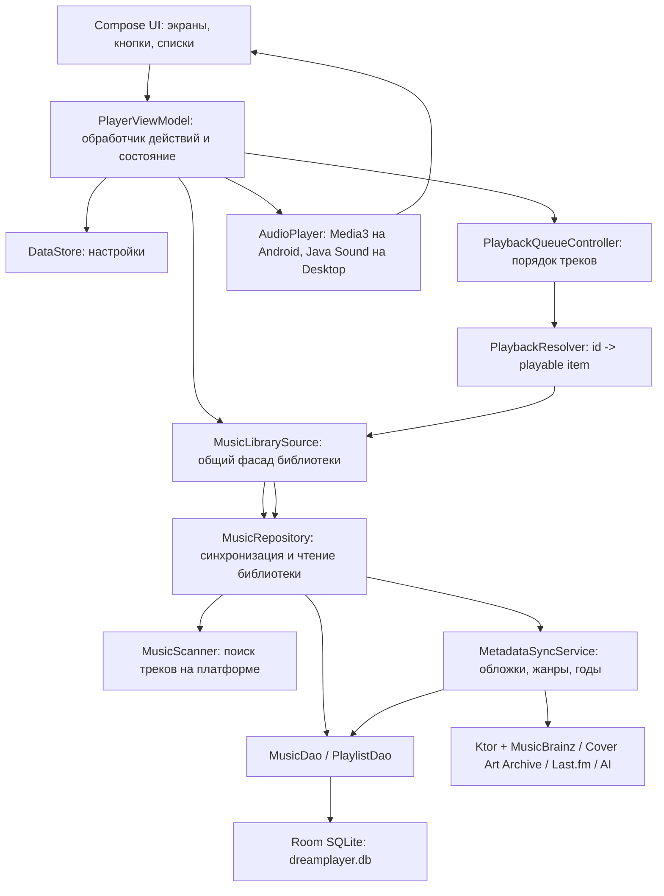

# Слепок архитектуры DreamPlayer

Этот документ описывает, как в проекте связаны база данных, сканеры музыки, источники данных, обработчики пользовательских действий, обогащение метаданными и воспроизведение. Формулировки намеренно простые: представь приложение как музыкальную библиотеку с кладовщиком, каталогом, кассиром на выдаче и проигрывателем.

## Главная идея

В приложении есть несколько слоев:

- UI показывает экраны и принимает клики пользователя.
- `PlayerViewModel` превращает клики в действия: загрузить библиотеку, открыть альбом, включить трек, перемешать очередь.
- `MusicLibrarySource` скрывает различия платформ: Android и Desktop вызывают один общий интерфейс, но внутри используют разные сканеры.
- `MusicRepository` синхронизирует музыку с базой: берет сырые треки от сканера, создает артистов/альбомы/треки, помечает пропавшие файлы, запускает дозагрузку метаданных.
- Room/SQLite хранит основную музыкальную библиотеку, плейлисты и состояние синхронизации.
- DataStore хранит пользовательские настройки.
- Playback-слой берет id треков из базы, превращает их в воспроизводимые URI и отдает платформенному плееру.



## Где что лежит

- Общая логика: `composeApp/src/commonMain/kotlin/org/milkdev/dreamplayer`.
- Android-реализации: `composeApp/src/androidMain/kotlin/org/milkdev/dreamplayer`.
- Desktop/JVM-реализации: `composeApp/src/jvmMain/kotlin/org/milkdev/dreamplayer`.
- База Room: `database/AppDatabase.kt`, `database/dao/*`, `database/entities/*`.
- Сканеры: `library/MusicScanner.kt`, `androidMain/.../MediaStoreScanner.kt`, `jvmMain/.../JvmMusicScanner.kt`.
- Фасад библиотеки: `library/MusicLibrarySource.kt` плюс `actual`-реализации для Android/JVM.
- Главный репозиторий библиотеки: `library/MusicRepository.kt`.
- Метаданные: `library/metadata/*`, `extensions/data/*`, `extensions/network/*`.
- Воспроизведение: `playback/*`.
- Главный обработчик состояния и действий: `model/PlayerViewModel.kt`.

Compose используется **только** в модуле `composeApp`. В модуль `shared` Compose не попадает — UI и логика строго разделены.

## База данных

Основная база - Room поверх SQLite. На обеих платформах файл называется `dreamplayer.db`, но лежит в разных местах:

- Android: `applicationContext.getDatabasePath("dreamplayer.db")`.
- Desktop: папка приложения `DreamPlayer` внутри `%APPDATA%`, `~/Library/Application Support` или `~/.config`.

Создание базы:

```kotlin
Room.databaseBuilder<AppDatabase>(
    context = applicationContext,
    name = dbFile.absolutePath,
    factory = AppDatabaseConstructor::initialize
)
    .setDriver(BundledSQLiteDriver())
    .addMigrations(Migration1To2, Migration2To3, ...)
    .setJournalMode(RoomDatabase.JournalMode.WRITE_AHEAD_LOGGING)
    .build()
```

Простыми словами: Room дает типобезопасный Kotlin-доступ к SQLite, а WAL-режим помогает читать и писать базу без лишних тормозов UI.

### Основные таблицы

- `artists` - артисты. Уникальны по имени.
- `albums` - альбомы. Привязаны к артисту через `artistId`.
- `library_tracks` - треки. У каждого трека есть путь/URI, название, артист, альбом, длительность, размер файла, признак наличия.
- `playlists` - пользовательские и системные плейлисты.
- `playlist_track_cross_ref` - связь “плейлист содержит трек” плюс позиция в плейлисте.
- `genres` - жанры.
- `album_genre_cross_ref`, `track_genre_cross_ref` - связи альбомов/треков с жанрами.
- `sync_audit` - журнал синхронизаций: когда сканировали, сколько нашли, успешно или с ошибкой.
- `album_metadata_state`, `track_metadata_state`, `metadata_resolution` - служебные таблицы для понимания, откуда взяты метаданные и насколько им можно доверять.

Связь можно читать так:

```text
Artist 1 -> много Albums
Album 1 -> много Tracks
Playlist много -> много Tracks через playlist_track_cross_ref
Genre много -> много Albums/Tracks через cross_ref таблицы
```

Пример сущности трека:

```kotlin
data class TrackEntity(
    val filePath: String,
    val title: String,
    val artistName: String,
    val albumName: String,
    val artistId: Long,
    val albumId: Long,
    val durationMs: Long,
    val fileSize: Long,
    val lastModified: Long,
    val mediaStoreId: Long? = null,
    val availability: String = "AVAILABLE",
    val isPresent: Boolean = true,
)
```

Для не-разработчика: это карточка песни в каталоге. В ней есть “где лежит файл”, “как называется”, “кто исполнитель”, “к какому альбому относится”, “можно ли сейчас включить”.

## DAO: кто читает и пишет базу

`MusicDao` работает с музыкальной библиотекой:

- вставляет артистов, альбомы, жанры;
- обновляет треки;
- отдает страницы треков/альбомов/артистов/жанров для UI;
- выбирает альбомы, которым нужны обложки или метаданные;
- помечает пропавшие треки;
- хранит audit синхронизации.

Пример: UI просит страницу треков, а DAO отдает уже готовые карточки для списка:

```kotlin
@Query("""
    SELECT t.id, t.title, t.artistName, t.albumName AS albumTitle, t.durationMs,
        a.year, a.genre,
        COALESCE(NULLIF(t.albumArtUri, ''), NULLIF(a.albumArtUri, ''), NULLIF(a.coverUri, '')) AS artworkUri
    FROM library_tracks t
    LEFT JOIN albums a ON t.albumId = a.id
    WHERE t.isPresent = 1
    ORDER BY t.titleSortKey ASC, t.id ASC
    LIMIT :limit
""")
suspend fun getTrackListItemsByTitle(...): List<TrackListItem>
```

`PlaylistDao` работает с плейлистами:

- создает плейлист;
- читает пользовательские плейлисты;
- читает треки конкретного плейлиста;
- заменяет состав плейлиста одной транзакцией.

## DataStore: настройки, не музыка

`DataStore` хранит настройки:

- включен ли blur;
- принудительная темная тема;
- режим генерации плейлиста дня;
- выбранный AI-провайдер, модель и промпт.

Это не основная база библиотеки. Если Room - большой каталог музыки, то DataStore - маленький блокнот с настройками пользователя.

## Сканеры

Общий контракт:

```kotlin
interface MusicScanner {
    fun scan(): Flow<RawTrackData>
    fun observeChanges(): Flow<Unit>
}
```

`scan()` находит треки и отдает поток `RawTrackData`. Это еще не запись базы, а “сырой результат сканирования”.

```kotlin
data class RawTrackData(
    val path: String,
    val mediaStoreId: Long? = null,
    val title: String?,
    val artist: String?,
    val album: String?,
    val durationMs: Long,
    val fileSize: Long,
    val lastModified: Long,
    val albumArtUri: String? = null,
)
```

### Android: MediaStoreScanner

Android не ходит по файловой системе напрямую. Он спрашивает системный каталог медиафайлов `MediaStore`.

Что делает:

- выбирает только музыкальные записи `IS_MUSIC != 0`;
- читает id, title, artist, album, duration, size, date_modified, album_id;
- строит `content://...` URI трека;
- строит URI локальной обложки альбома;
- подписывается на изменения `MediaStore` через `ContentObserver`.

Для не-разработчика: Android уже ведет свой список музыки на устройстве, приложение спрашивает этот список у системы.

### Desktop/JVM: JvmMusicScanner

Desktop-версия смотрит папку `~/Music`.

Что делает:

- берет файлы с расширениями `flac`, `mp3`, `wav`;
- через Java Sound и дополнительные декодеры читает формат;
- для MP3/FLAC пытается достать встроенную обложку;
- если встроенной обложки нет, ищет рядом `cover.jpg`, `folder.png`, `front.webp` и похожие файлы;
- возвращает `RawTrackData`.

Для не-разработчика: Desktop сам открывает папку с музыкой и читает бирки внутри файлов.

## Синхронизация библиотеки

Сердце процесса - `MusicRepository.sync()`.

Упрощенный сценарий:

1. Сканер находит сырые треки.
2. Репозиторий создает недостающих артистов.
3. Репозиторий создает недостающие альбомы.
4. Репозиторий обновляет или вставляет треки.
5. Старые треки, которых больше не нашли, помечаются как missing.
6. Очень старые удаленные записи чистятся.
7. Пишется `sync_audit`.
8. Очищается кеш playback-элементов.
9. Запускается фоновая дозагрузка обложек/метаданных.

Фрагмент:

```kotlin
val rawTracks = scanner.scan().toList()
val artistMap = syncArtists(rawTracks)
val albumMap = syncAlbums(rawTracks, artistMap, currentSyncTimestamp)

rawTracks.chunked(BatchSize).forEach { batch ->
    processBatch(batch, currentSyncTimestamp, artistMap, albumMap, movedTrackQueues)
}

markMissingTracks(rawTracks, currentSyncTimestamp)
musicDao.insertAudit(SyncAuditEntity(...))
metadataSyncService.startAutoBatch()
```

Важная деталь: трек сопоставляется не только по пути. Если файл переехал, код пытается узнать его по “подписи”: название + артист + длительность + размер. Это снижает шанс потерять историю трека при переносе файла.

## Метаданные и обложки

Есть два вида обогащения:

### Локальные embedded-метаданные

После обновления треков `MusicRepository` запускает чтение встроенных тегов:

- MusicBrainz recording MBID;
- жанры;
- год;
- fingerprint тегов.

Если найден `recordingMbid`, он записывается в `library_tracks.musicBrainzRecordingMbid`. Если найдены жанры, они пишутся в `genres` и `track_genre_cross_ref`.

### Сетевые метаданные

`MetadataSyncService` работает с альбомами:

- сначала ищет обложки через MusicBrainz/Cover Art Archive;
- затем, при ручной синхронизации, добирает год/жанры/обложки через MusicBrainz и Last.fm;
- учитывает rate limit;
- хранит состояние `NOT_SYNCED`, `PENDING`, `DONE`, `FAILED`, `NO_MATCH`;
- использует “trust” числа, чтобы более надежный источник не перезаписывался менее надежным.

Пример логики доверия:

```kotlin
val yearChoice = chooseTrustedValue(
    current = album.year,
    currentTrust = album.yearSourceTrust,
    candidates = listOf(
        TrustedValue(musicBrainz?.year, TRUST_MUSICBRAINZ_YEAR),
        TrustedValue(lastFmMetadata?.year, TRUST_LASTFM_YEAR),
    ),
)
```

Для не-разработчика: если год уже был найден из более надежного места, приложение не заменяет его чем-то сомнительным.

## Источники данных

- Android MediaStore - локальная медиатека устройства.
- Desktop `~/Music` - локальные аудиофайлы.
- Embedded tags - данные внутри MP3/FLAC.
- Sidecar images - картинки рядом с аудиофайлом: `cover`, `folder`, `front`.
- MusicBrainz - идентификация альбомов, годы, жанры, release group MBID.
- Cover Art Archive - обложки по MusicBrainz release group.
- Last.fm - жанры, даты, обложки, если задан API-ключ.
- AI-провайдеры - только для плейлиста дня: OpenAI, Gemini, DeepSeek.

Сетевые запросы идут через Ktor и проверяются `SecureNetworkPolicy`: только HTTPS и только разрешенные host.

```kotlin
object NetworkHosts {
    const val OpenAi = "api.openai.com"
    const val Gemini = "generativelanguage.googleapis.com"
    const val DeepSeek = "api.deepseek.com"
    const val LastFm = "ws.audioscrobbler.com"
    const val MusicBrainz = "musicbrainz.org"
    const val CoverArtArchive = "coverartarchive.org"
}
```

## Плейлисты

Плейлист - это не копия треков, а список ссылок на треки.

```kotlin
data class PlaylistTrackCrossRef(
    val playlistId: Long,
    val trackId: Long,
    val position: Int
)
```

`PlaylistRepository` дает простые операции:

- создать пользовательский плейлист;
- получить треки плейлиста;
- заменить треки плейлиста;
- подготовить перемешанную очередь.

Есть системный плейлист:

```kotlin
object SystemPlaylists {
    const val DAILY_PLAYLIST_ID = -1L
    const val DAILY_PLAYLIST_NAME = "Плейлист дня"
}
```

## Плейлист дня и AI

`DailyPlaylistRepository` каждый день проверяет, нужно ли пересобрать системный плейлист.

Варианты:

- `LOCAL_DAILY` - взять случайные доступные треки из базы.
- `AI_API` - взять до 200 случайных кандидатов, отправить их AI-провайдеру, получить список id, отфильтровать и сохранить.

Если AI не сработал, приложение падает обратно на локальный вариант, а в debug-info сохраняет причину.

Для не-разработчика: AI не получает файлы музыки, он получает таблицу кандидатов вида “id, артист, трек, альбом” и возвращает id подходящих треков.

## Воспроизведение

Воспроизведение специально отделено от базы. Плеер не должен сам ходить в SQL. Он получает готовый `PlaybackSnapshot`.

### Основные участники

- `PlaybackQueueController` хранит порядок id треков, текущий индекс, shuffle и версию очереди.
- `PlaybackResolver` превращает id треков в `ResolvedPlaybackItem`.
- `MusicLibrarySource.resolvePlayableItems()` читает треки из базы через `MusicRepository`.
- `AudioPlayer` играет уже resolved-элементы.

Модель воспроизведения:

```kotlin
data class PlaybackItemRef(
    val trackId: Long,
    val uri: String,
    val availability: TrackAvailability,
    val contentVersion: Long,
)

data class ResolvedPlaybackItem(
    val ref: PlaybackItemRef,
    val metadata: TrackPlaybackMetadata,
)
```

`trackId` - номер карточки в каталоге. `uri` - где реально лежит аудио. `availability` - можно ли его сейчас включить. `contentVersion` - версия содержимого, чтобы кеш MediaItem не устаревал.

### Что происходит, когда пользователь нажимает на трек

1. UI вызывает `playerViewModel.playFromVisibleTracks(...)`.
2. `PlayerViewModel` кладет id треков в `PlaybackQueueController`.
3. `PlaybackResolver` просит библиотеку разрешить id в playable items.
4. `PlayerViewModel` обновляет UI-состояние.
5. `AudioPlayer.play(snapshot)` отправляет очередь платформенному плееру.

Ключевой фрагмент:

```kotlin
private fun playPreparedQueue(tracks: List<LibraryTrack>, startIndex: Int) {
    val snapshot = playbackQueueController.setQueue(
        trackIds = tracks.map { it.id }.toLongArray(),
        startIndex = startIndex,
    )
    applyQueueSnapshot(snapshot, PlaybackSnapshotApplyMode.Play)
}
```

А затем:

```kotlin
private fun applyQueueSnapshot(queueSnapshot: PlaybackQueueSnapshot, mode: PlaybackSnapshotApplyMode) {
    storeScope.launch {
        val playbackSnapshot = PlaybackResolver.resolve(queueSnapshot)
        ...
        when (mode) {
            PlaybackSnapshotApplyMode.Play -> AudioPlayer.play(playbackSnapshot)
            PlaybackSnapshotApplyMode.Update -> AudioPlayer.updateQueue(playbackSnapshot)
            PlaybackSnapshotApplyMode.Move -> AudioPlayer.moveQueueItem(...)
        }
    }
}
```

### Android AudioPlayer

Android использует Media3:

- `PlaybackService` создает `ExoPlayer` и `MediaSession`;
- `AudioPlayer.android.kt` подключается к сервису через `MediaController`;
- треки превращаются в `MediaItem`;
- системная media session позволяет нормальную интеграцию с Android.

Пример превращения трека в Media3 item:

```kotlin
MediaItem.Builder()
    .setMediaId(trackId.toString())
    .setUri(ref.uri.toUri())
    .setMediaMetadata(
        MediaMetadata.Builder()
            .setTitle(metadata.title)
            .setArtist(metadata.artistName)
            .setAlbumTitle(metadata.albumName)
            .setArtworkUri(metadata.albumArtUri?.toUri())
            .build()
    )
    .build()
```

### Desktop AudioPlayer

Desktop использует Java Sound:

- открывает локальный файл;
- для FLAC использует `flannel`;
- для MP3 использует `mp3spi`;
- декодирует в PCM;
- пишет аудиобуфер в `SourceDataLine`;
- сам обрабатывает pause/resume/seek/next.

Для не-разработчика: Android отдает музыку системному медиаплееру, Desktop сам декодирует аудио и пишет звук в аудиовыход.

## PlayerViewModel как главный обработчик

`PlayerViewModel` — синглтон, инициализированный в `App.kt` (модуль `composeApp`). Живёт всё время жизни процесса приложения и никогда не пересоздаётся. Не использует Android ViewModel или Jetpack Lifecycle — только собственные мультиплатформенные механизмы. Центральный диспетчер приложения. Он:

- хранит `PlayerUiState`;
- подписывается на `AudioPlayer.state`;
- подписывается на плейлисты и настройки;
- загружает страницы библиотеки;
- обрабатывает навигацию;
- запускает синхронизацию;
- управляет очередью и плеером.

Примеры обработчиков:

```kotlin
fun pause() {
    AudioPlayer.pause()
    _state.update { it.copy(isPlaying = false) }
}

fun playNext() {
    val snapshot = playbackQueueController.skipToNext() ?: return
    applyQueueSnapshot(snapshot, PlaybackSnapshotApplyMode.Play)
}

fun seekTo(positionMs: Long) {
    AudioPlayer.seekTo(positionMs)
    _state.update { it.copy(playbackProgressMs = positionMs) }
}
```

Это “пульт управления”: экран не знает, как устроена база или Media3. Экран вызывает понятный метод, а ViewModel уже знает, кому передать работу.

## Жизненный цикл запуска

Android:

1. `DreamPlayerApplication` сохраняет `applicationContext`.
2. `MainActivity` запрашивает разрешение `READ_MEDIA_AUDIO` или `READ_EXTERNAL_STORAGE`.
3. `App(isPermissionGranted)` запускает UI.
4. `LaunchedEffect(isPermissionGranted)` вызывает `playerViewModel.loadLibrary()`.
5. Библиотека сканируется через `MediaStoreScanner`.

Desktop:

1. `desktopApp/Main.kt` открывает Compose Window.
2. `App()` стартует сразу.
3. `loadLibrary()` сканирует `~/Music` через `JvmMusicScanner`.

## Библиотеки и за что они отвечают

- Kotlin Multiplatform - общий код для Android и Desktop.
- Compose Multiplatform / Material3 - UI.
- Room - типизированная SQLite-база.
- SQLite bundled driver - одинаковый SQLite-драйвер на платформах.
- DataStore Preferences - настройки.
- Ktor Client - сетевые запросы.
- kotlinx.serialization - JSON.
- Media3 ExoPlayer + Session - Android-воспроизведение.
- Java Sound - Desktop-воспроизведение.
- mp3spi - чтение/декодирование MP3 на Desktop.
- flannel - чтение/декодирование FLAC на Desktop.
- kotlinx.coroutines Flow/StateFlow - реактивные потоки состояния.

## Коротко: кто за что отвечает

- `MediaStoreScanner` / `JvmMusicScanner`: найти музыку на устройстве.
- `MusicRepository`: превратить найденное в нормальную библиотеку в базе.
- `MusicDao`: выполнить SQL-запросы к музыкальным таблицам.
- `PlaylistDao`: выполнить SQL-запросы к плейлистам.
- `MetadataSyncService`: дозаполнить альбомы обложками, годами, жанрами.
- `CoverArtRepository`, `MusicBrainzMetadataRepository`, `LastFmRepository`: сходить во внешние сервисы и привести ответы к понятным моделям.
- `SettingsRepository`: читать/писать настройки DataStore.
- `DailyPlaylistRepository`: собрать плейлист дня локально или через AI.
- `PlayerViewModel`: принять действие пользователя и обновить состояние приложения.
- `PlaybackQueueController`: хранить порядок воспроизведения.
- `PlaybackResolver`: превратить очередь id в очередь воспроизводимых элементов.
- `AudioPlayer.android.kt`: играть через Android Media3.
- `AudioPlayer.jvm.kt`: играть через Java Sound.

## Самый важный поток данных

```text
Сканер -> RawTrackData -> MusicRepository -> Room DB -> MusicLibrarySource -> PlayerViewModel -> UI
```

А когда надо играть:

```text
Клик по треку -> PlayerViewModel -> PlaybackQueueController -> PlaybackResolver
-> MusicRepository.resolvePlayableItems -> AudioPlayer -> звук
```

И когда надо обогатить библиотеку:

```text
Room albums -> MetadataSyncService -> MusicBrainz / Cover Art Archive / Last.fm
-> Room albums/genres/metadata_state -> UI видит новые обложки, жанры и годы
```
